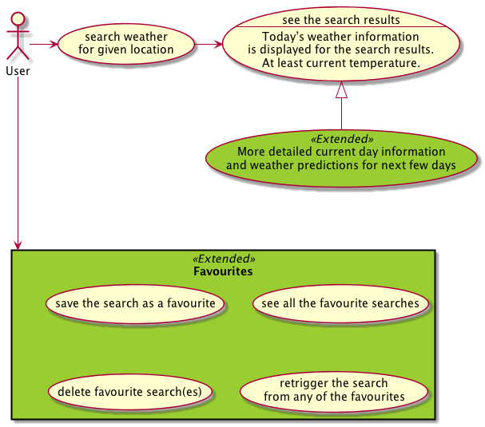
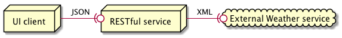

# Weather RESTful service

Simple weather RESTful API implementation with using the Spring Framework.

## Analyze 

Application definition.

### Use Case



### Data flow



## Usage

From the root of the repository:

Run the REST service:
```
cd rest
mvn spring-boot:run
```

Run the frontend part:
```
cd frontend
mvn spring-boot:run -Dserver.port=9000
```
